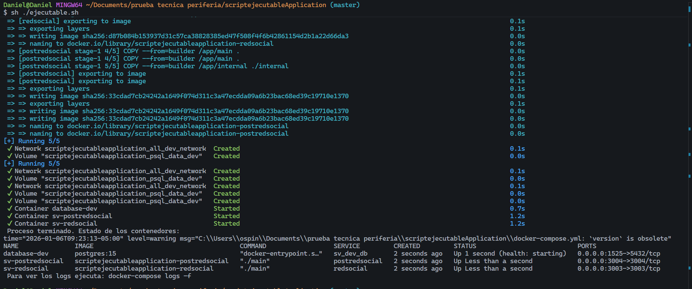
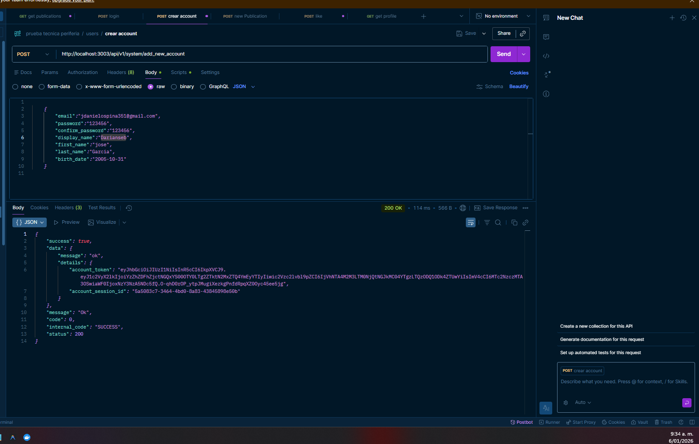
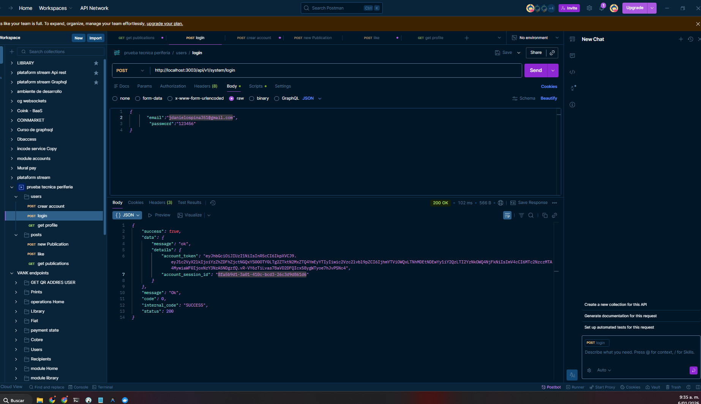
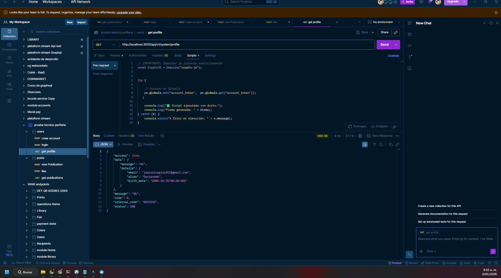
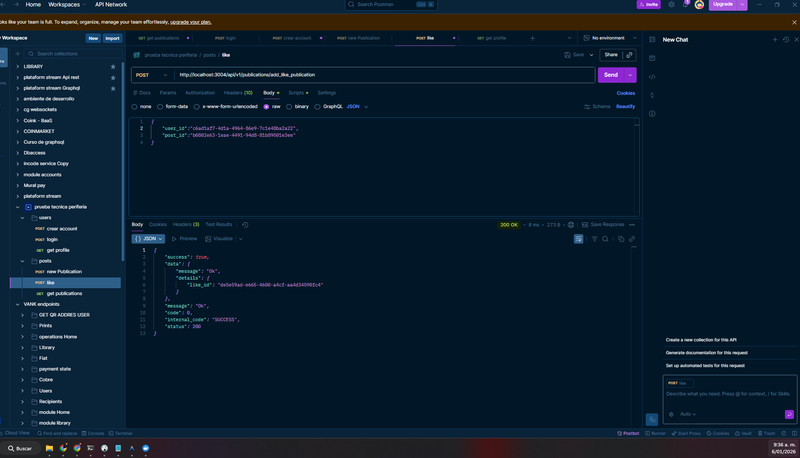
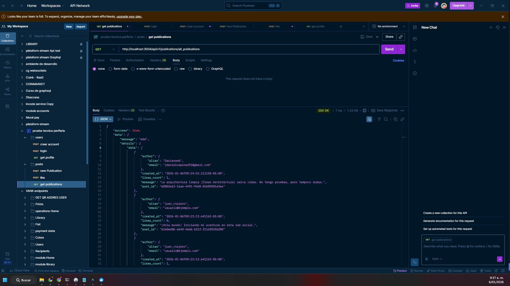

## Levantamiendo de back microservicios

## Comandoa  ejecutar, si esta en windows se recomeinta utilizar git bash

* clona repositorios
    * redsocial: servicio de authenticacion(login,registro, opterner datos del usuario)
    * postredsocial: permite publicar posts, like, obtener 
* levanta docker composer
    * levantamos la imagen de posgres a la ultima version
    * ejecutamos scripts sql(ddl y dml) para la creacion de tablas y creacion del perfil de un usaurio de pruebas
    * orquestamos los 2 otros microservicios(redsocial,postredsocial)
    publicaciones de todos los usuarios

> comando: sh ./ejecutable.sh

## Arquitectura y Stack Tecnológico de los Microservicios

* El proyecto ha sido diseñado bajo los principios de la Arquitectura `Hexagonal (Puertos y Adaptadores)`, con el objetivo de lograr un desacoplamiento total entre la lógica de negocio y las dependencias externas.

1. El Núcleo: Casos de Uso y Puertos

    * La lógica de negocio reside en el Core (application - Casos de Uso). Esta capa es agnóstica a la infraestructura:

    * `Puertos (Interfaces)`: Definimos contratos estrictos que actúan como la única vía de comunicación. El Caso de Uso solo sabe qué datos enviar y qué esperar recibir a través del puerto, sin saber si al otro lado hay una base de datos PostgreSQL, una API externa o un sistema de archivos.

    * Independencia: Esto permite que el negocio no se vea afectado si decidimos cambiar de motor de base de datos o de framework web.

2. Flujo de Datos y Comunicación (Commands & DTOs)
    * Para mantener la integridad y el orden en el flujo de información, implementamos:

    * Controladores (Fiber): Reciben el Request HTTP y lo validan.
 
    * Transformación: El DTO de entrada se convierte en una Estructura/Command.

    * Commands: Estas estructuras son las que cruzan la frontera hacia los Puertos. De esta forma, los adaptadores y puertos hablan un mismo "idioma" estructurado, evitando pasar objetos crudos de la web a la lógica interna.

    * Entidades de Entrada/Salida: Definimos modelos claros para lo que el sistema acepta y lo que retorna, garantizando contratos consistentes.

3. Inyección de Dependencias con Uber Fx
    * Utilizamos el framework Fx para la gestión del ciclo de vida y la inyección de dependencias.

    * Desacoplamiento Real: Fx nos permite definir los contratos entre adaptadores y puertos de forma transparente.

    * Modularidad: Facilita la conexión de los componentes (servicios, repositorios, controladores) sin crear dependencias circulares, asegurando que cada pieza se inyecte donde el contrato lo requiera.

4. Stack de Infraestructura
    * Framework Web: Fiber, seleccionado por su alto rendimiento y minimalismo en Go.

    * Persistencia: PostgreSQL como motor principal, gestionado a través de GORM (ORM) para una manipulación de datos eficiente y segura.

    * Seguridad: Implementación de JWT (JSON Web Tokens) para la autenticación y autorización entre servicios.

    * Observabilidad: Implementé un sistema de Logs Estructurados en formato JSON. Esto permite que los reportes sean procesables por máquinas (como ELK Stack o CloudWatch), facilitando el rastreo de errores y el monitoreo en entornos de microservicios.
    
### proceso de levantamiendo de docker composer

### Test de creacion de cuenta

### Test de login 

## Test del pefil del usuario 

## Test de crear  publication

## Test de like

## Test de crear publicaciones
